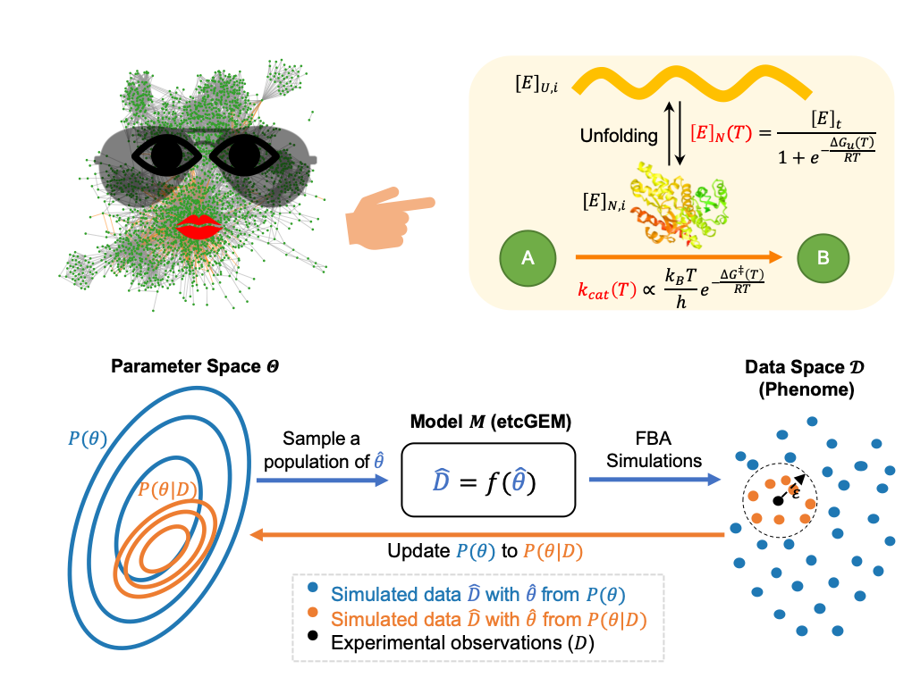

## GETCool: Using Bayesian statistical learning to integrate temperature dependence in enzyme-constrained GEMs


#### Description of folders
* `code/` contains all scripts and detailed descrition can be found in `code/README.md`
* `data/` contains all input data needed, including experimental and estimated thermal parameters
* `models/` contains a list of yeast genome scale models with different settings used in this study.


#### Dependences
```
numpy                       1.15.0  
pandas                      0.23.4
scikit-learn                0.20.3
seaborn                     0.9.0
jupyter                     1.0.0
cobra                       0.15.3  
Gurobi                      8.0.0
```
The repository was tested with Python 3.6.7.

#### Hardware
Since Bayesian approach is computational expsensive, all scripts except ones for visualizaiton have to be done with a computer cluster. Those scripts have been designed for parallel computation. 

#### Reproduce the figures
The pre-computed results are available on Zenodo (https://zenodo.org/deposit/3686996). Download the `results.tar.gz` file to the current directory and uncompress with 
```
tar -xzvf results.tar.gz
```
Then the figures in the manuscript can be reproduced by using jupyter notebooks
```
visualization.ipynb                               
visualize_chemostat_metabolic_shift.ipynb         
visualize_cv.ipynb                                
visualize_temperature_on_enzymes_posterior.ipynb 
```

One can also recompute those results by following the introductions in `code/README.md` and the visualized by the above scripts.
